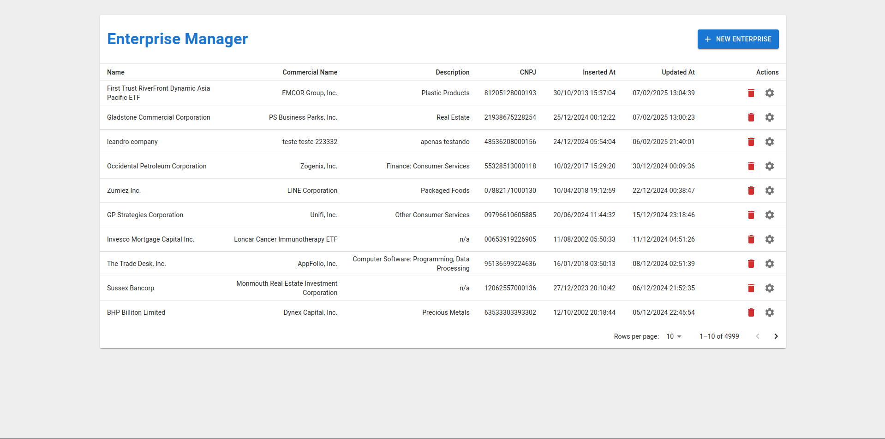
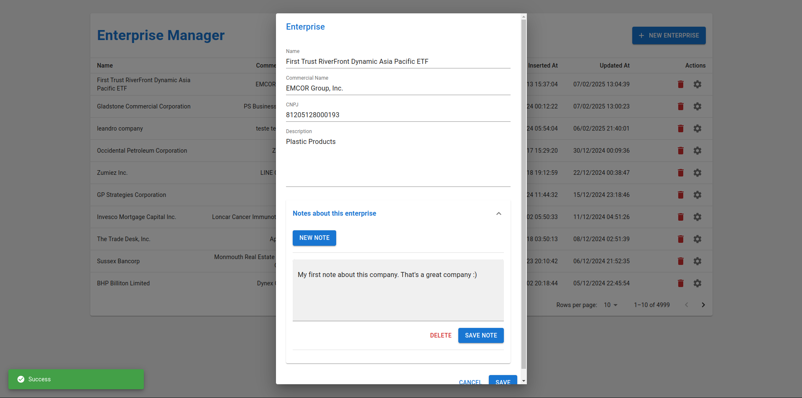

# Frontend Recruitment Test

## General setup instructions

> To run this project, first run the backend. You can find it [here](https://github.com/LeandroVCastro/backend-recruitment-test).

> I recommend using [NVM](https://github.com/nvm-sh/nvm) to run this project, but you can run it using node v23.5.0.

### Is it your first time running this project?

```bash
# You just need to run this command on the first time
cp .env.example .env
```

### If you're using NVM, select the correct Node's version:

```bash
nvm use
```

### If you don't have yarn installed, install it:

```bash
npm install --global yarn
```

### Install project's dependencies

```bash
yarn
```

### Start the server

```bash
yarn start
```

- You can now view the application in the browser: http://localhost:3000



